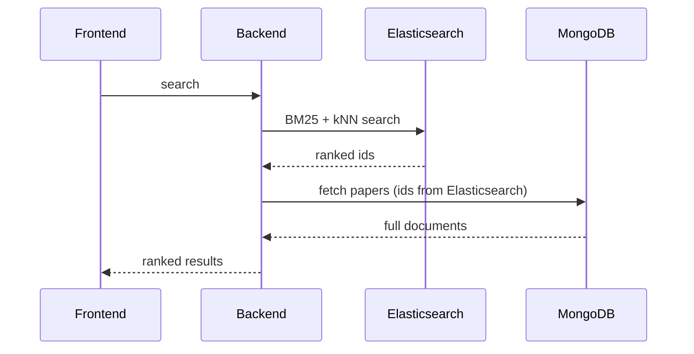

# ElasticPom

Hybrid search engine for scientific papers — combines keyword (BM25) and semantic (vector) search, fused with Reciprocal Rank Fusion.

## How It Works

- **Ingestion (Python):** harvests paper metadata from OAI-PMH-compliant sources, embeds each paper with a sentence-transformer model, and writes to MongoDB (source of truth) and Elasticsearch (search index, text + vector).
- **Backend (Java + Spring Boot):** exposes default relevance, BM25, semantic, and hybrid search. Hybrid search runs BM25 and kNN independently, then merges the two rankings with Reciprocal Rank Fusion. Query embeddings are generated locally so they land in the same vector space as the ingested corpus.
- **Frontend (SvelteKit):** search bar, filters, pagination, results.

## Tech Stack

- Python 3.11
- Java 21 + Spring Boot
- MongoDB 8.2.6
- Elasticsearch 9.3.2
- SvelteKit + TypeScript + Tailwind CSS

## Diagram



## Use Cases

- Find relevant papers using natural language, not just exact keywords
- Surface related work even when it uses different terminology than the search
- Filter results by metadata (date, subject, author) without losing relevance ranking

## Set-up

```bash
git clone https://github.com/Gabriel-Gerhardt/ElasticPom.git
cd ElasticPom

# Infrastructure (MongoDB + Elasticsearch)
cd backend && docker compose up -d

# Ingestion
cd ingestor
python3 -m venv .venv && source .venv/bin/activate
pip install -r requirements.txt
python3 main.py

# Backend (downloads embedding model on first run)
cd ../elasticpom
./gradlew downloadEmbeddingModel
./gradlew bootRun

# Frontend
cd ../../frontend
npm install
npm run dev
```

Access:
- `GET /api/papers/most-relevant/?page-size=10&page=0`
- `POST /api/papers/hybrid-search`
- Frontend: `http://localhost:5173`

## Contact

- LinkedIn: https://www.linkedin.com/in/gabriel-gerhardt-0a8b852b9/
- Email: gabrielgerhardt27@gmail.com
- GitHub: https://github.com/Gabriel-Gerhardt
